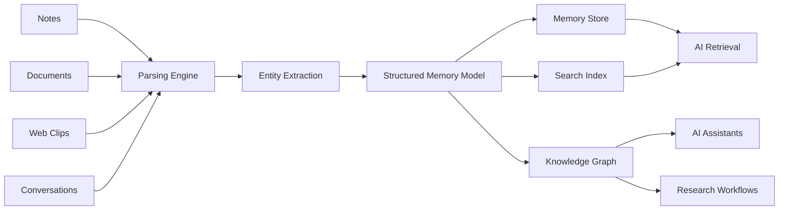

# OpenMemo

> OpenMemo is an AI-native structured memory system for long-term knowledge.

Instead of storing notes as plain text, OpenMemo organizes information into structured data that AI systems can understand, retrieve, and reuse.

---

## Why OpenMemo

Most notes are written for humans.

But modern AI systems work best when knowledge is structured, contextual, and connected.

OpenMemo helps transform everyday information into a structured memory layer that powers:

- AI-assisted workflows
- Knowledge retrieval
- Research systems
- Long-term memory
- Automation pipelines

---

## Architecture

OpenMemo converts raw information into structured memory.



OpenMemo transforms raw notes into structured memory AI can actually use.

---

## Features

- Structured note format
- AI-ready knowledge storage
- Context-aware search
- Modular API architecture
- AI integration ready

---

## Example Use Cases

OpenMemo can power:

- AI research assistants
- Personal knowledge bases
- Documentation systems
- Memory layers for AI tools
- Long-term note storage

---

## Getting Started

Clone the repository:

```bash
git clone https://github.com/allanyao/openmemo.git
```

Install dependencies:

```bash
pip install -e ".[dev]"
```

Quick example:

```python
from openmemo import Memory

memory = Memory()

memory.add("User prefers dark mode")
memory.add("Project deadline is March 15")

results = memory.recall("user preference")
for r in results:
    print(r["content"], r["score"])
```

---

## Roadmap

Upcoming features:

- Knowledge graph visualization
- AI summarization pipelines
- Plugin system
- External integrations
- Memory retrieval APIs

---

## Contributing

We welcome contributions from the community.

Please read the [CONTRIBUTING.md](CONTRIBUTING.md) file before submitting pull requests.

---

## License

OpenMemo is licensed under the **AGPLv3 License**.

This means:

- You can use and modify the software.
- If you deploy a modified version as a network service, the source code of those modifications must also be released.

See the [LICENSE](LICENSE) file for details.

---

## Trademark

OpenMemo is a trademark of the project maintainers.

Forks must not use the OpenMemo name or branding in a way that implies affiliation with the original project.

---

## Community

If you are interested in building AI-native knowledge systems, OpenMemo aims to be a foundation for that ecosystem.

Stay tuned for updates and roadmap discussions.
