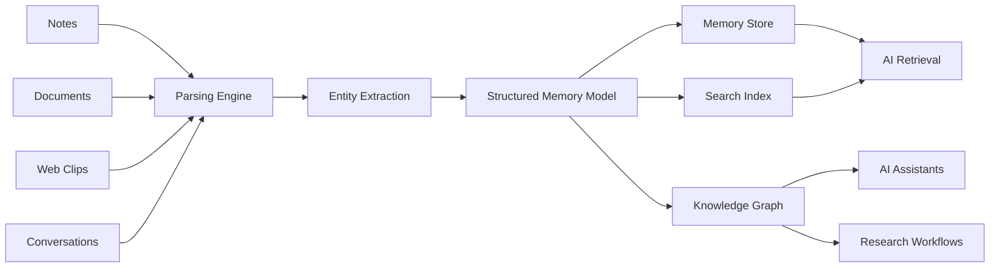

# OpenMemo

> OpenMemo is an AI-native structured memory system for long-term knowledge.

Instead of storing notes as plain text, OpenMemo organizes information into structured data that AI systems can understand, retrieve, and reuse.

---

## Why OpenMemo

Most notes are written for humans.

But modern AI systems work best when knowledge is structured, contextual, and connected.

OpenMemo helps transform everyday information into a structured memory layer that powers:

- AI-assisted workflows
- Knowledge retrieval
- Research systems
- Long-term memory
- Automation pipelines

---

## Architecture

OpenMemo converts raw information into structured memory.



OpenMemo transforms raw notes into structured memory AI can actually use.

---

## Features

- Structured note format
- AI-ready knowledge storage
- Context-aware search (BM25 + vector similarity)
- Modular API architecture (Python SDK + REST)
- AI integration ready
- Memory Pyramid for automatic compression
- Conflict detection and version management

---

## Example Use Cases

OpenMemo can power:

- AI research assistants
- Personal knowledge bases
- Documentation systems
- Memory layers for AI tools
- Long-term note storage

---

## Getting Started

### Install from GitHub

```bash
pip install git+https://github.com/openmemoai/openmemo.git
```

### Or clone and install locally

```bash
git clone https://github.com/openmemoai/openmemo.git
cd openmemo
pip install -e ".[dev]"
```

### Quick example

```python
from openmemo import Memory

memory = Memory()

memory.add("User prefers dark mode")
memory.add("Project deadline is March 15")

results = memory.recall("user preference")
for r in results:
    print(r["content"], r["score"])
```

### With vector search (optional)

```python
from openmemo import Memory

def my_embed(text):
    # Use any embedding model
    return model.encode(text).tolist()

memory = Memory(embed_fn=my_embed)
memory.add("User prefers dark mode")
results = memory.recall("UI preference")  # Uses both BM25 + vector similarity
```

### REST Server

```bash
pip install openmemo[server]
python -m openmemo.api.rest_server
```

```bash
# Add a memory
curl -X POST http://localhost:8080/api/memories \
  -H "Content-Type: application/json" \
  -d '{"content": "User prefers dark mode"}'

# Recall
curl -X POST http://localhost:8080/api/memories/recall \
  -H "Content-Type: application/json" \
  -d '{"query": "user preference"}'
```

### Docker

```bash
cd docker
docker compose up
```

---

## Roadmap

Upcoming features:

- Knowledge graph visualization
- AI summarization pipelines
- Plugin system
- External integrations
- Distributed memory sync

---

## Contributing

We welcome contributions from the community.

Please read the [CONTRIBUTING.md](CONTRIBUTING.md) file before submitting pull requests.

---

## License

OpenMemo is licensed under the **AGPLv3 License**.

This means:

- You can use and modify the software.
- If you deploy a modified version as a network service, the source code of those modifications must also be released.

See the [LICENSE](LICENSE) file for details.

---

## Trademark

OpenMemo is a trademark of the project maintainers.

Forks must not use the OpenMemo name or branding in a way that implies affiliation with the original project.

---

## Community

If you are interested in building AI-native knowledge systems, OpenMemo aims to be a foundation for that ecosystem.

Stay tuned for updates and roadmap discussions.
